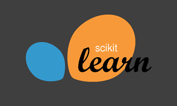

<!-- <h1 align="center">Hi 👋, I'm VINAY MOOLYA</h1> -->
<h3 align="center" style="color:#d68813;font-family:Fira Code;"><i>A Passionate Web Developer and an Budding AI/ML Enthusiast from India.</i></h3>

<h1 align="center" style="font-family:Sans-Serif;">👋🏻 About Me</h1>

A determined and disciplined Web Developer who is adaptable and a life long learner possessing great interpersonal and problem solving skills. Wish to Contribute to the Tech Industry and is passionate about developing high impact , reliable , scalable and progressive applications. I like to explore emerging technologies and experiment with new tools and frameworks. I'm excited to showcase my technical skills and share my projects with you on this platform. Let's connect and discuss how we can collaborate to build something great!

<h2 align ="center">Languages / Technologies & Tools</h2>

    
    
    
    
    
    
    
    

<h2 align="center">Projects</h2>

<table border="1" 
       cellpadding="10"
       cellspacing="10"
       width="100%">
    <thead>
        <tr>
            <th class="center" width="20%">Title</th>
            <th class="center" width="50%">Description</th>
            <th class="center" width="30%">Link</th>
        </tr>
    </thead>
    <tbody border=1>
        <tr>
            <td class="center">URL Shortener</td>
            <td class="center">Developed a URL shortener utility with React and SHRT CODE API.</td>
            <td class="center">
                <a href="https://github.com/VinayMoolya/URL_Shortener" target="_blank">Repository</a> 
            </td>
        </tr>
        <tr>
            <td class="center">Currency Converter</td>
            <td class="center">Developed a Currency Converter utility with React and freecurrency API.</td>
            <td class="center">
                <a href="https://github.com/VinayMoolya/Currency_Converter" target="_blank">Repository</a> 
            </td>
        </tr>
        <tr>
            <td class="center">GPT-3 Theme Website</td>
            <td class="center">Developed a GPT-3 themed website using React and styling from Scratch CSS.</td>
            <td class="center">
                <a href="https://github.com/VinayMoolya/GPT-3_responsive_Frontend" target="_blank">Repository</a> 
            </td>
        </tr>
        <tr>
            <td class="center">Google Drive Clone (EdriveFMS)</td>
            <td class="center">A Cloud-Based Storage Service built using React, Node and Firebase</td>
            <td class="center">
                <a href="https://github.com/VinayMoolya/gdrivefms" target="_blank">Repository</a> 
                <a href="https://vinaymoolya.github.io/gdrivefms/" target="_blank">Live Link</a>
            </td>
        </tr>
        <tr>
            <td class="center">CryptoFinance Tracker</td>
            <td class="center">A CryptoCurrency Tracker built using React , Material-UI and Coingecko API.</td>
            <td class="center"> 
                <a href="https://vinaymoolya.github.io/cryptotracker/" target="_blank">Repository</a> 
                <a href="https://vinaymoolya.github.io/cryptotracker/" target="_blank">Live Link</a>
            </td>
        </tr>
        <tr>
            <td class="center">Multi-Class Brain Tumor Classification Model</td>
            <td class="center"> Expirimented on various Transfer Learning models and other CNN models to achieve multi-class Classification.</td>
            <td class="center">
                <a href="https://github.com/VinayMoolya/BrainTumor_SI" target="_blank">Repository</a> 
            </td>
        </tr>
        <tr>
            <td class="center">Progressive Weather Application</td>
            <td class="center">Developed a Weather Application built it using React and openweather API which was then transformed to progressive application.</td>
            <td class="center">
                <a href="https://github.com/VinayMoolya/weather_pwa" target="_blank">Repository</a> 
            </td>
        </tr>
        <tr>
            <td class="center">NBA MVP Prediction</td>
            <td class="center">Built a model to predict the next MVP in NBA season with historical data. Built using Python and Webmining Concepts.</td>
            <td class="center">
                <a href="https://github.com/VinayMoolya/NBA_MVP_23_Prediction" target="_blank">Repository</a> 
            </td>
        </tr>
        <tr>
            <td class="center">Cataract Prediction</td>
            <td class="center">Built an Machine Learning Model using various Transfer Learning models to justify the multi-class classification of cataract eye samples.</td>
            <td class="center">
                <a href="https://github.com/VinayMoolya/Cataract_Prediction_ML" target="_blank">Repository</a> 
            </td>
        </tr>
    </tbody>
</table>

<h2>📈 My Github Status</h2>

Let's Connect

        
        
        

<h3 align="center" style="font-family:Sans-Serif;">👋🏻 That's it About me !! See ya Soon !</h3>

<!---
VinayMoolya/VinayMoolya is a ✨ special ✨ repository because its `README.md` (this file) appears on your GitHub profile.
You can click the Preview link to take a look at your changes.
--->
